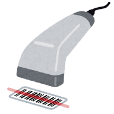

# bacomark

  

bacomark is the barcode scanner application. You can get the product name and search it to any shop site easily.

# How to Use
Please watch this movie.

  

# Install

# Development Environment
This application is written in Javascript.
Please see "package.json" to check a dependency.

# Contact us
Please send the email to this address.
nao.lunalovegood@gmail.com
